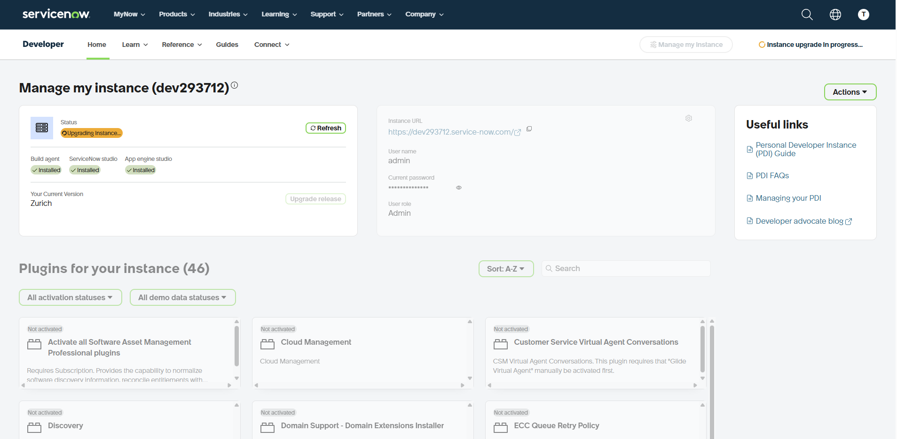
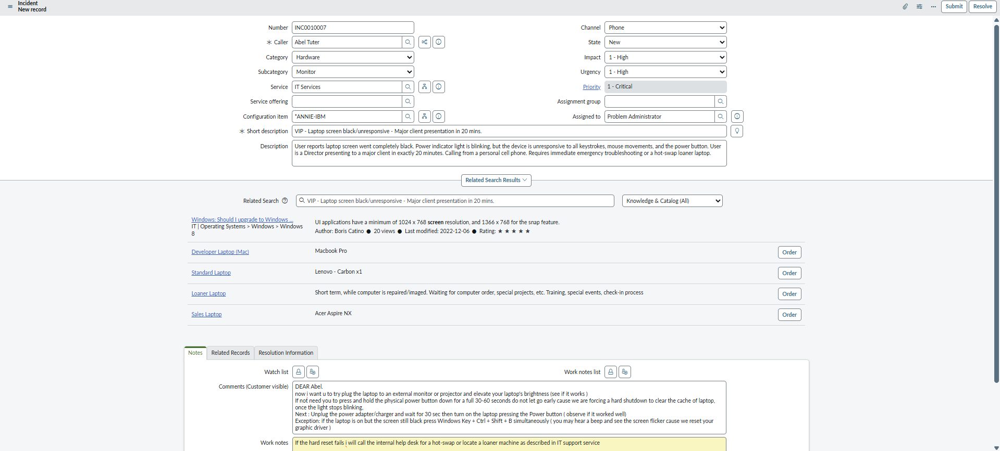
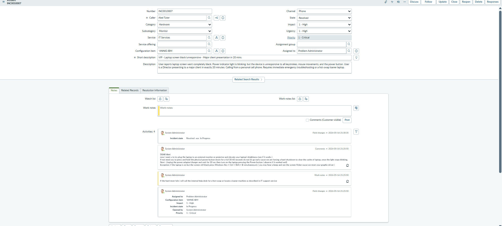
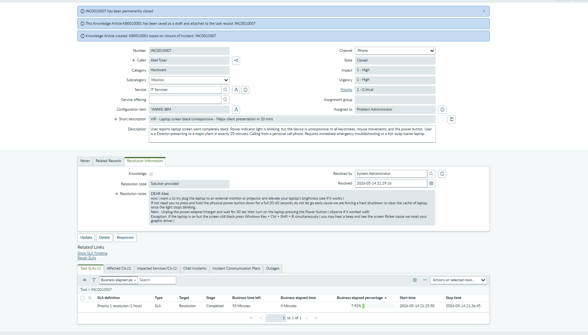

# Enterprise ITSM Workflows: ServiceNow Incident Management

## 📌 Objective
This repository demonstrates practical application of the **ITIL v4 Framework** for Incident Management using a ServiceNow Developer Instance. It showcases the complete lifecycle of a Critical/VIP hardware incident, from initial triage and priority matrix calculation to workaround deployment, resolution, and final documentation.

## 🏢 Use-Case Scenario: VIP Hardware Failure
* **User:** Director of Sales (VIP Status)
* **Issue:** Laptop screen is black/unresponsive; power indicator is blinking.
* **Business Impact:** User is scheduled to present to a major client in 20 minutes. 
* **Objective:** Restore service or provide a workaround immediately to ensure Business Continuity, then document the resolution according to strict SLA guidelines.

---

## 🛠️ The Incident Lifecycle

### 1. Environment Setup & Ticket Generation
Utilizing the ServiceNow ITIL interface to log the initial call. 
* Captured caller details and provided a concise, actionable Short Description.
* Bypassed the quick-create panel to access the full ITIL Incident form for accurate triage.

### 2. ITIL Triage & Ticket Submission
Applying the ServiceNow Priority Matrix to ensure SLA compliance.
* **Impact:** Assessed as `1 - High` due to the user's VIP status and the immediate threat to revenue-generating business activities.
* **Urgency:** Assessed as `1 - High` due to the strict 20-minute deadline.
* **Result:** ServiceNow automatically generated a `Priority 1 - Critical` incident. Ticket ownership was immediately claimed by assigning it to the local IT Support Administrator.

### 3. Troubleshooting & Immediate Workaround
Executed Tier 1/Tier 2 remote troubleshooting protocols over the phone:
1. **Flea Power Drain:** Instructed user to hold the power button for 30-60 seconds to clear motherboard cache and force a hard reset. 
2. **Graphics Driver Reset:** Instructed user to execute `Win + Ctrl + Shift + B` to restart the display adapter.
3. **Business Continuity Workaround:** When the built-in LCD remained unresponsive, instructed the user to connect the laptop to the conference room projector via HDMI. The external display functioned correctly, allowing the presentation to proceed on time.

### 4. Resolution & SLA Documentation
Closing the loop to maintain accurate Configuration Management Database (CMDB) records and SLA metrics.
* **State Change:** Moved from *In Progress* to *Resolved*.
* **Resolution Code:** Logged as *Workaround Provided*.
* **Work Notes:** Documented the exact troubleshooting steps taken, the successful workaround, and the post-meeting plan to provide a hot-swap loaner device and send the original asset for LCD repair.

---

## 💡 Technical Skills Demonstrated
* **ITSM Platforms:** ServiceNow 
* **ITIL Processes:** Incident Management, SLA Adherence, Ticket Triage (Impact vs. Urgency).
* **Hardware Troubleshooting:** Power cycling, BIOS/hibernation state resets, peripheral workarounds.
* **Soft Skills:** VIP Stakeholder management, high-pressure crisis resolution, clear documentation.

  
